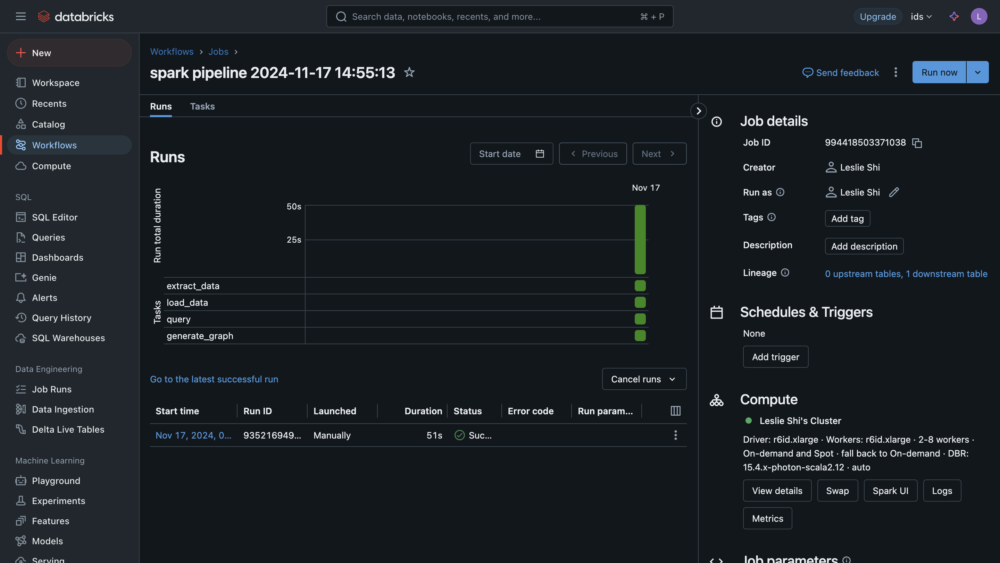
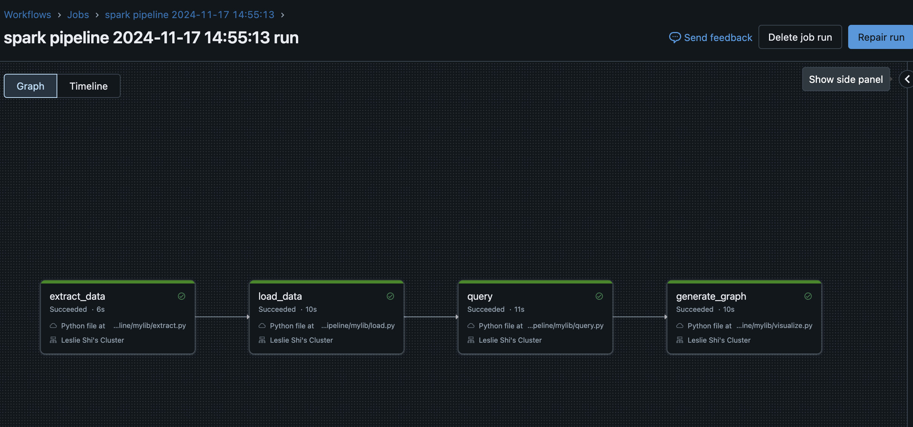
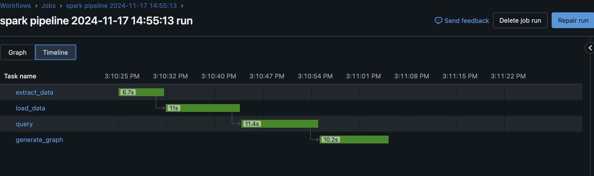

# IDS706 Database CommandLine Tool
  
## Getting Started

### Prerequisites

- Python 3.9 or higher
- Docker (if using DevContainer)

### **Report for IDS706 Data Pipeline Project**

---

#### **Introduction**

This project involves building a data pipeline using Databricks to demonstrate end-to-end data engineering workflows. The pipeline includes data extraction, transformation, querying, and visualization stages. It adheres to the requirements, ensuring proper data source and sink configuration, and integrates a CI/CD pipeline for robust development and deployment processes.

---

#### **Pipeline Overview**

The pipeline has four stages:

1. **Extract**: Data is extracted from the source.
2. **Load**: The data is loaded into a Delta table on Databricks.
3. **Query**: SQL queries are executed to analyze the data.
4. **Visualize**: Results are visualized for insights.

The pipeline flow is visualized below:  

Each stage was executed successfully in Databricks, as seen in the task execution details:  

---

#### **Data Source and Sink**

- **Data Source**:  
  A public dataset, "Alcohol Consumption by Country," is loaded into a Databricks table named `alcohol_data`.

- **Data Sink**:  
  Processed data is saved as:
  - A Parquet file (`dbfs:/FileStore/mini_proj11/query_result.parquet`).
  - Intermediate and transformed data stored in Delta tables for efficient querying.

---

#### **Results and Analysis**

The pipeline outputs both tabular results and visual insights:

1. **Wine Quality Analysis Results**:  
   A Spark SQL query was executed to analyze wine quality against its chemical properties.  
   The results include average alcohol content, fixed acidity, and volatile acidity levels grouped by wine quality.

2. **Visualizations**:  
   - **Acidity Levels by Wine Quality**:  
     Fixed and volatile acidity levels for different wine qualities were analyzed and visualized:  
     ![**\[Insert Acidity Levels Visualization Here\]**](acidity_by_quality.png)

   - **Average Alcohol Content by Wine Quality**:  
     Higher-quality wines generally exhibit higher alcohol content:  
     ![**\[Insert Average Alcohol Content Visualization Here\]**](avg_alcohol_by_quality.png)

---

#### **CI/CD Pipeline**

A CI/CD pipeline was integrated using **GitHub Actions**:
- **Pipeline Functionality**:
  - Automated testing of the pipeline stages.
  - Deployment to Databricks upon successful validation.

#### **README Overview**

The README file provides comprehensive details about the project:
1. **Prerequisites**: Tools required, such as Python 3.9+ and Docker (optional).
2. **Installation Instructions**:
   - Clone the repository.
   - Install required dependencies.
3. **Usage**:
   - Running the pipeline with actions like `load` or `query`.
   - Testing and code formatting.
4. **Development Environment**: Includes optional Docker DevContainer setup for consistent development environments.

#### **Deliverables**

1. **Databricks Notebook or Script**:
   - The `job.py` script contains the full implementation of the pipeline.
2. **Visual Outputs**:
   - Graphs showcasing acidity levels and alcohol content grouped by wine quality.
3. **CI/CD Workflow**:
   - GitHub Actions workflow ensures automated testing and deployment.

This report demonstrates the successful implementation of the Databricks data pipeline, meeting all requirements with analytical results and visualizations to support insights